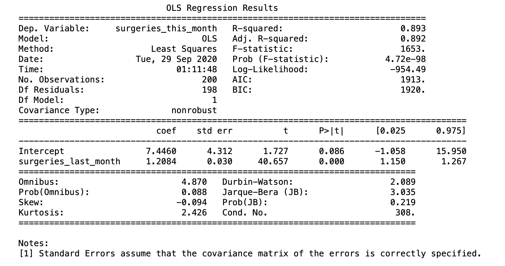

# HIQ_data
hosptialIQ

### 1. Instructions for running your Python script locally.

in your terminal window and run the following code: 

```bash
python regression.py
```


### 2. What you would have done prior to fitting the regression model if we didn't assure you that the data were already clean?

a) check typos, duplicates, any missing, NaN data (maybe think of a way to fill in those missing data)
b) check if any negative values (all data shall be positive in this case), any irrelevant data (something could be super large) 
c) check the range, mean, median, and outlier of numerical data 
d) plot the graph surgeries_this_month vs. the rest variables such as surgeries_last_month 
e) check the correlation between variables 

### How did you decide on the covariates in your model?

Even though I was told that all the data are chosen from one hospital, so all hosptial_id = 1. I still chose to use all given variables: 'age_in_yrs', 'hospital_id', 'service_id', 'surgeries_last_month' as independent variables, and used surgeries_this_month as the dependent variable. I ran the linear regression model first, and found out that R-squared = 0.909. However, only the coeffiecient of the variable 'surgeries_this_month' has the P-value which is less than 0.05, and the rest are greater than 0.05. Hence, I decided to use 'surgeries_this_month' as the only independent variable and 'surgeries_last_month' as the dependent variable. 


### What is your interpretation of the coefficients of the variables in your model?

The linear regression model is: surgeries_this_month = m*surgeries_last_month + b where the coefficients m =1.2084, and b = 7.4460. 

The coefficient b = 7.4460 means that the doctor would have about 7 surgeries this month even if the doctor had zero surgery last month. In other words, Each doctor would have at least 7 surgeries each month. 

The coefficient m = m =1.2084 means that the number of surgery for each doctor would increase by 1 after each month.  

### How well does this model fit the data overall?

Since R-squared = 0.893 which is close to 1, F-statistic = 1653 which is large, and Prob (F-statistic) = 4.72e-98 which is close to zero, the model fits well. Also, when I only had 'surgeries_last_month' as independent variables, I got the Adj. R-squared = 0.892. It also indicate that the model fits well as well because initally when I ran the linear regression model with all given variables: 'age_in_yrs', 'hospital_id', 'service_id', 'surgeries_last_month' as independent variables, I also got Adj. R-squared = 0.892. 


### What is the output of RegressionResults.summary? (Nothing other than the raw output of that method is needed.)


